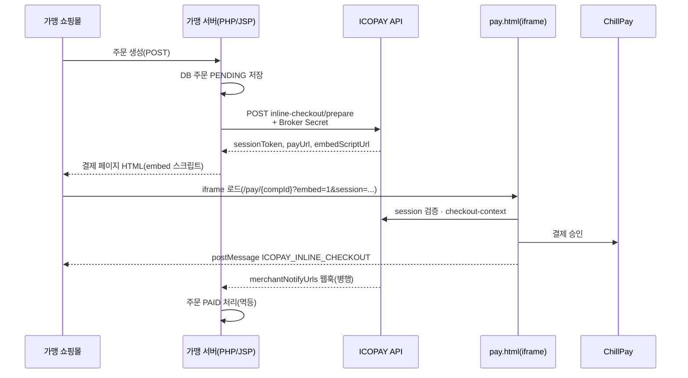

# ChillPay URL 결제 — 인라인 API 배포 가이드

| 항목 | 내용 |
|------|------|
| **문서명** | ChillPay URL 결제 인라인 API 배포 가이드 |
| **배포 대상** | ICOPAY 본사(운영) · 가맹점(또는 용역 개발사) |
| **연동 방식** | **URL 결제** + **INLINE** (가맹 쇼핑몰에 ICOPAY `pay.html` iframe 삽입) |
| **API 경로** | `/api/middleware/v1/merchant/chillpay/inline-checkout/*` |
| **관련 매뉴얼** | 개발 상세 → `가맹점_ChillPay_API_연동가이드.md` · 목차 → `가맹점_API_연동_매뉴얼_목차.md` |

---

## 1. 이 문서의 범위

본 가이드는 **ChillPay URL 결제**를 **인라인 iframe 방식**으로 가맹 쇼핑몰에 붙일 때, **본사(HQ) 설정 → 서버 배포 → 가맹점 연동 → 검수·오픈**까지의 **운영·배포 절차**를 정리합니다.

| 구분 | 설명 |
|------|------|
| **URL 결제** | ChillPay 연동용도 `URL결제 Y` 인 PG 바인딩으로 처리하는 공개 결제 플로우 |
| **INLINE** | 고객이 가맹 사이트를 벗어나지 않고 ICOPAY `pay.html` 이 iframe 으로 표시 |
| **인라인 API** | 가맹 **서버**가 `prepare` 로 세션을 만들고, 브라우저는 `sessionToken` 으로 embed |

> **DirectCredit REST(`/pg/chillpay/request`) 직접 호출** 방식은 본 문서 범위가 아닙니다. 해당 내용은 `가맹점_ChillPay_API_연동가이드.md` 를 참고하세요.

---

## 2. 전체 흐름 (한눈에)



**핵심:** 브로커 시크릿은 **가맹 서버에만** 둡니다. 브라우저·앱에는 노출하지 않습니다.

---

## 3. Part A — ICOPAY 본사 배포 (선행 작업)

### 3.1 서버(JAR) 배포

인라인 API·embed 위젯·결제창 언어 자동 감지는 **pg-app JAR** 에 포함됩니다.

| 단계 | 작업 |
|------|------|
| 1 | `pg-app/build/libs/pg-app-0.0.1-SNAPSHOT.jar` 빌드 |
| 2 | 운영 VPS에 JAR 업로드(기존 파일 덮어쓰기) |
| 3 | `./restart-pg-app.sh` 실행 |

상세: `배포_가이드_FTP_업로드_및_재시작.md`

### 3.2 본사 관리 화면 설정 (필수)

관리자: `https://icopay.co.kr` (또는 운영 도메인)

#### (1) 본사설정 → 결제로직설정

| 항목 | 값 | 비고 |
|------|-----|------|
| **URL 결제형 INLINE 제공** | **사용(Y)** | `urlPayInlineEnabledYn` |
| URL 결제 입력 폼 | FULL / SIMPLE | 가맹 UX 선택 |
| URL 결제 기본 방식 | **INLINE** | REDIRECT 가 아님 |

#### (2) 본사설정 → URL결제설정

ChillPay PG 코드(예: `CHILLPAY`) 행에 FX·통화를 맞춥니다.

| 모드 | amountMode | 용도 |
|------|------------|------|
| 일반 | STANDARD | 가맹 청구통화 그대로 결제 |
| 표시 FX | **DISPLAY (DP)** | 쇼핑몰 표시통화(예: USD) → 실결제·정산통화(예: THB) |
| 블라인드 | BLIND | UI만 숨김 |

**DISPLAY 예 (태국 정산 가맹):**

```json
{
  "amountMode": "DISPLAY",
  "displayCurrency": "USD",
  "displayCurrencyMode": "FIXED",
  "settlementCurrency": "THB",
  "fxSource": "BOT"
}
```

> 가맹 `prepare` 의 `currency` 는 **표시통화**(예: `USD`)와 일치시킵니다.

#### (3) 본사설정 → API연동설정 (ChillPay)

| 항목 | 값 |
|------|-----|
| 연동용도 **URL결제** | **Y** |
| 운영 여부 | **Y** |

#### (4) 가맹점 → 결제대행사 (해당 compId)

| 항목 | 값 |
|------|-----|
| PG | ChillPay **WEB** 운영 바인딩 |
| 연동용도 | URL결제 **Y** (또는 복합) |
| URL금액 | 본사 URL결제설정과 동일 (일반 / DP / BLIND) |

#### (5) 가맹점 → 업체정보

| 항목 | 값 |
|------|-----|
| **웹결제** | **Y** |

`WEB_PAYMENT_DISABLED` 오류 시 이 값을 확인합니다.

#### (6) 배포설정 → 가맹점 API 생성

| 항목 | 설명 |
|------|------|
| 대상 compId | 가맹 업체코드 |
| PG 범위 | **CHILLPAY** (또는 ALL) |
| 브로커 시크릿 | **재발급** 시 `brokerSecretPlain` 1회 표시 → 가맹 서버에만 저장 |
| 연동 키트 JSON | `merchantInlineCheckoutChillPay`, `merchantIntegrationSamples` 확인 |

---

## 4. Part B — 가맹점 배포

### 4.1 본사가 가맹점에 전달할 것

| # | 항목 |
|---|------|
| 1 | 업체코드 `compId` |
| 2 | 운영 `publicApiBaseUrl` (예: `https://api.icopay.co.kr`) |
| 3 | 브로커 시크릿 + **강제(enforce) 여부** |
| 4 | 연동 키트 JSON (`merchantInlineCheckoutChillPay` 블록) |
| 5 | 통보(웹훅) URL 등록 요건 (`merchantNotifyUrls`) |
| 6 | **본 문서(PDF/MD)** + 샘플 다운로드 URL |

샘플 다운로드: `{publicApiBaseUrl}/merchant-api-samples/index.html`

### 4.2 가맹 서버 구현 (권장 순서)

1. **주문 API** — 결제 전 DB에 주문 `PENDING` 저장, `orderNo` 확정(최대 **20자**)
2. **prepare** — 서버에서만 호출 (브로커 시크릿 헤더)
3. **결제 페이지** — `sessionToken` 으로 embed HTML 출력
4. **완료 처리** — `postMessage` + **웹훅** 멱등 처리
5. (선택) **status** 폴링 — 웹훅 지연 시 보조

### 4.3 PHP 연동 예 (최소)

**설정** (`icopay_config.php` — document root 밖 권장):

```php
return [
    'api_base_url' => 'https://api.icopay.co.kr',
    'comp_id'      => '6000000028',
    'broker_secret'=> '발급받은_시크릿',
];
```

**prepare (서버):**

```php
$api = IcopayMerchantApi::fromConfig($config);
$prep = $api->prepareInlineCheckout(
    IcopayMerchantApi::VENDOR_CHILLPAY,
    $orderNo,
    $amount,
    'USD',           // DISPLAY 모드면 표시통화
    $productName
    // lang 생략 시 Accept-Language·페이지 lang 자동
);
$token = $prep['data']['sessionToken'];
echo $api->buildEmbedHtml(IcopayMerchantApi::VENDOR_CHILLPAY, $token);
```

**완료 수신 (브라우저):**

```html
<script src="https://api.icopay.co.kr/merchant-api-samples/common/icopay-checkout.js"></script>
<script>
IcopayCheckout.onMessage(function (detail) {
  if (detail.phase === 'finished' && detail.success) {
    location.href = '/order/complete?orderNo=' + encodeURIComponent(detail.orderNo);
  }
}, 'https://api.icopay.co.kr');
</script>
```

전체 예제: `merchant-api-samples/php/checkout_chillpay.php`

### 4.4 Embed 스크립트 (키트 권장 방식)

```html
<div id="icopay-pay-checkout"></div>
<script src="https://api.icopay.co.kr/v1/embed-pay/{compId}"
        data-session-token="{sessionToken}"
        data-target="icopay-pay-checkout"
        async defer charset="utf-8"></script>
```

| data 속성 | 설명 |
|-----------|------|
| `data-session-token` | **필수** — prepare 응답 |
| `data-target` | iframe 을 넣을 div id (기본 `icopay-pay-checkout`) |
| `data-lang` | 선택 — `KOR` `ENG` `JPN` `CHN` `THA` |

### 4.5 payUrl 직접 iframe (대안)

prepare 응답의 `payUrl` 을 그대로 iframe `src` 로 사용할 수 있습니다.

```
https://api.icopay.co.kr/pay/{compId}?entry=merchant_api&embed=1&session={token}&orderNo=...&amount=...&currency=USD&lang=ENG
```

---

## 5. Part C — 인라인 API 명세

**베이스 URL:** `{publicApiBaseUrl}/api/middleware/v1/merchant/chillpay/inline-checkout`

**공통 헤더 (브로커 강제 시 필수):**

```
X-Icopay-Merchant-Broker-Secret: {brokerSecret}
Content-Type: application/json
Accept: application/json
```

### 5.1 POST `/prepare`

결제 세션 발급. **가맹 서버에서만** 호출.

**요청 본문:**

| 필드 | 필수 | 설명 |
|------|------|------|
| `compId` | ○ | 업체코드 |
| `orderNo` | ○ | 주문번호 (≤20자) |
| `amount` | ○ | 금액 (숫자) |
| `currency` | △ | 3자 통화. DISPLAY 모드면 **표시통화** |
| `productName` / `item` | △ | 상품명 |
| `lang` / `langCode` / `locale` | △ | 결제창 UI 언어 (아래 §6) |

**요청 예:**

```json
{
  "compId": "6000000028",
  "orderNo": "ORD20260523001",
  "amount": 99.00,
  "currency": "USD",
  "productName": "Sample product",
  "lang": "ENG"
}
```

**성공 응답 `data` (주요 필드):**

| 필드 | 설명 |
|------|------|
| `sessionToken` | embed·payUrl 에 사용 (유효 **30분**) |
| `payUrl` | iframe 직접 연결 URL (`&lang=` 포함 가능) |
| `embedScriptUrl` | `/v1/embed-pay/{compId}` |
| `langCode` | 적용된 UI 언어 |
| `compId`, `orderNo`, `amount`, `currency`, `productName` | 세션 고정값 |

### 5.2 GET `/session?token={sessionToken}`

`pay.html` 이 iframe 로드 시 금액·주문번호 잠금 검증에 사용. 가맹점 직접 호출은 선택.

### 5.3 GET `/status?compId={compId}&orderNo={orderNo}`

브로커 시크릿 필요. `paymentStatus`: `NOT_FOUND` | `PAID` | `FAILED` | `CANCELLED` 등.

### 5.4 postMessage — `ICOPAY_INLINE_CHECKOUT`

iframe → 가맹 부모 페이지. **origin 검증 필수** (`publicApiBaseUrl` origin).

| detail.phase | 의미 |
|--------------|------|
| `wait_authorize` | 3DS·리다이렉트 대기 |
| `finished` | 최종 결과 (`success` true/false) |

---

## 6. Part D — 결제창 언어 (다국어)

가맹 사이트 언어에 맞춰 결제 UI가 자동 전환됩니다.

### 6.1 지원 코드

| 코드 | 언어 |
|------|------|
| KOR | 한국어 |
| ENG | English |
| JPN | 日本語 |
| CHN | 中文 |
| THA | ไทย |

### 6.2 적용 우선순위

1. `prepare` JSON — `lang` / `langCode` / `locale` (`ENG`, `ja`, `ko` 등 별칭 가능)
2. embed — `data-lang="JPN"`
3. **자동** — 가맹 페이지 `<html lang="en">` → embed 위젯이 감지
4. **자동** — 브라우저 `Accept-Language` / `navigator.languages`
5. (pay.html 직접 접속) URL `?lang=ENG`

### 6.3 가맹점 권장 설정

| 사이트 | HTML | prepare lang (선택) |
|--------|------|---------------------|
| 영어 | `<html lang="en">` | `"lang": "ENG"` |
| 한국어 | `<html lang="ko">` | `"lang": "KOR"` |
| 일본어 | `<html lang="ja">` | `"lang": "JPN"` |

embed만 쓰고 `<html lang>` 만 맞춰 두면 **가맹 코드 수정 없이** 언어가 맞춰집니다.

---

## 7. Part E — DISPLAY FX 가맹 배포 예 (Pentakleva 유형)

| 항목 | 예시 값 |
|------|---------|
| compId | `6000000028` |
| 쇼핑몰 | 영어 사이트 (`lang="en"`) |
| 표시통화 | USD (고객 UI) |
| 정산통화 | THB |
| prepare currency | **USD** |
| 본사 URL결제설정 | `amountMode: DISPLAY`, `displayCurrency: USD`, `settlementCurrency: THB` |

**주의:** PG 연동용도 **「API」** 는 필수가 **아닙니다**. **URL결제 Y** + **INLINE Y** + **웹결제 Y** 가 핵심입니다.

---

## 8. Part F — 배포·검수 체크리스트

### 8.1 본사 (HQ)

- [ ] JAR 배포 및 `restart-pg-app.sh` 완료
- [ ] 결제로직 — URL INLINE **Y**
- [ ] ChillPay API연동 — URL결제 **Y**, 운영 **Y**
- [ ] URL결제설정 — FX·통화(compId별) 확인
- [ ] 가맹 — 웹결제 **Y**, ChillPay WEB URL 바인딩
- [ ] 가맹점 API 생성 — CHILLPAY 브로커 시크릿 발급·키트 JSON 전달
- [ ] `merchantNotifyUrls` 가맹 웹훅 URL 등록

### 8.2 가맹점

- [ ] `icopay_config` — compId·api_base_url·broker_secret (서버만)
- [ ] 주문 → prepare → embed 흐름 구현
- [ ] `<html lang>` 또는 `lang` / `data-lang` 설정
- [ ] postMessage origin 검증
- [ ] 웹훅 HTTPS·멱등·로그 (카드번호·CVV 저장 금지)
- [ ] 스테이징 1건 → 운영 전환

### 8.3 통합 테스트 시나리오

1. 소액 주문 → embed 결제창 표시
2. 결제창 언어 = 쇼핑몰 언어
3. DISPLAY 모드 — UI 금액·통화 = 표시통화
4. 승인 후 postMessage + 웹훅 모두 수신
5. ICOPAY 관리 — URL결제내역·결제내역에 거래 반영
6. `status` — `PAID` 확인

---

## 9. Part G — 자주 나는 오류

| errorCode | 원인 | 조치 |
|-----------|------|------|
| `BROKER_AUTH` | 시크릿 누락·오류 | 헤더·compId·PG범위(CHILLPAY) 확인 |
| `WEB_PAYMENT_DISABLED` | 웹결제 N | 가맹 업체정보 웹결제 Y |
| `URL_PAYMENT_PG_MISSING` | URL결제 바인딩 없음 | 결제대행사 ChillPay URL Y |
| `INLINE_NOT_ENABLED` | INLINE 꺼짐 | 결제로직 URL INLINE Y |
| `INVALID_ORDER_NO` | orderNo 없음·초과 | ≤20자 |
| `INVALID_AMOUNT` | amount ≤0 | 숫자·소수 확인 |
| `INVALID_SESSION` | 토큰 만료 | 30분 내 prepare 재호출 |
| `DISPLAY_FX_*` | FX 설정·견적 | URL결제설정·표시통화 일치 |

---

## 10. Part H — 참고 URL·파일

| 구분 | 경로 |
|------|------|
| prepare | `POST {BASE}/api/middleware/v1/merchant/chillpay/inline-checkout/prepare` |
| status | `GET .../inline-checkout/status?compId=&orderNo=` |
| embed bootstrap | `GET {BASE}/v1/embed-pay/{compId}` |
| 결제 페이지 | `{BASE}/pay/{compId}?entry=merchant_api&embed=1&session=...` |
| PHP 클라이언트 | `merchant-api-samples/php/IcopayMerchantApi.php` |
| PHP 예제 | `merchant-api-samples/php/checkout_chillpay.php` |
| JSP 예제 | `merchant-api-samples/jsp/checkout-chillpay.jsp` |
| postMessage JS | `merchant-api-samples/common/icopay-checkout.js` |
| 키트 JSON 키 | `merchantInlineCheckoutChillPay`, `merchantIntegrationSamples` |

---

## 개정 이력

| 버전 | 일자 | 요약 |
|------|------|------|
| 1.0 | 2026-05-23 | ChillPay URL 결제 인라인 API 배포 가이드 최초 작성 (언어 자동 감지 포함) |

---

**문의:** 계약·키·본사 설정·CCD — 플랫폼(본사) 관리자 채널  
**개발 API 상세:** `가맹점_ChillPay_API_연동가이드.md`
