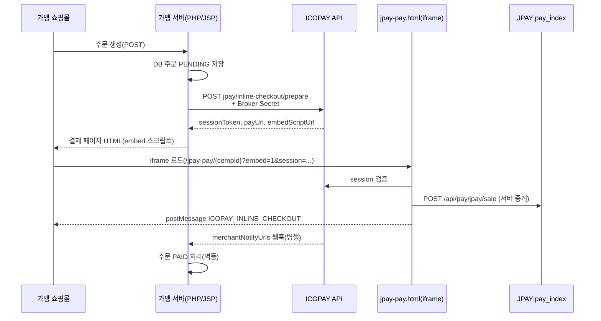

# JPAY URL 결제 — 인라인 API 배포 가이드

| 항목 | 내용 |
|------|------|
| **문서명** | JPAY URL 결제 인라인 API 배포 가이드 |
| **배포 대상** | ICOPAY 본사(운영) · 가맹점(또는 용역 개발사) |
| **연동 방식** | **API 중계형 URL 결제** + **INLINE** (가맹 쇼핑몰에 ICOPAY `jpay-pay.html` iframe 삽입) |
| **API 경로** | `/api/middleware/v1/merchant/jpay/inline-checkout/*` |
| **관련 매뉴얼** | 개발 상세 → `가맹점_JPAY_API_연동가이드.md` · 목차 → `가맹점_API_연동_매뉴얼_목차.md` |

---

## 1. 이 문서의 범위

본 가이드는 **JPAY** 결제를 **인라인 iframe 방식**으로 가맹 쇼핑몰에 붙일 때, **본사(HQ) 설정 → 서버 배포 → 가맹점 연동 → 검수·오픈**까지의 **운영·배포 절차**를 정리합니다.

| 구분 | 설명 |
|------|------|
| **API 중계형 URL 결제** | 가맹 서버가 `prepare` 로 세션을 만들고, ICOPAY `jpay-pay.html` 이 카드 입력·3DS·`pay_index` 호출을 대리 |
| **INLINE** | 고객이 가맹 사이트를 벗어나지 않고 결제 UI가 iframe 으로 표시 |
| **인라인 API** | 가맹 **서버**가 `prepare` → `sessionToken` → embed 스크립트 또는 `payUrl` iframe |

> **가맹 서버가 직접 `POST .../pg/jpay/sale` 을 호출**하는 방식(서버-투-서버)은 본 문서 범위가 아닙니다. 해당 내용은 `가맹점_JPAY_API_연동가이드.md` §5 를 참고하세요.  
> **ChillPay URL 결제**는 `ChillPay_URL결제_인라인API_배포가이드.md` 를 사용하세요.

### 1.1 아키텍처 (JPAY 1:1 · 가맹 1:N)

| 관계 | 설명 |
|------|------|
| **JPAY : ICOPAY = 1:1** | J-Pay 계약·ApiKey·`pay_index`·노티/callback URL 은 **ICOPAY 본사** 한 곳 |
| **ICOPAY : 가맹 = 1:N** | 가맹은 **ICOPAY API만** 연동 (`compId`, 브로커 시크릿, `inline-checkout/prepare`) |
| **PG 호출** | ICOPAY가 가맹별 **MID**(`pay_memberid`)로 [J-Pay Sale](https://docs.j-pay.net/docs/api/sale) `pay_index` 대리 호출 |

가맹점은 J-Pay MID·ApiKey를 직접 보관하지 않습니다(본사 `tb_pg_agency` + 가맹 바인딩 MID).

---

## 2. 전체 흐름 (한눈에)



**핵심:** 브로커 시크릿은 **가맹 서버에만** 둡니다. 브라우저·앱에는 노출하지 않습니다.

---

## 3. Part A — ICOPAY 본사 배포 (선행 작업)

### 3.1 서버(JAR) 배포

인라인 API·embed 위젯·`jpay-pay.html` 은 **pg-app JAR** 에 포함됩니다.

| 단계 | 작업 |
|------|------|
| 1 | `pg-app/build/libs/pg-app-0.0.1-SNAPSHOT.jar` 빌드 |
| 2 | 운영 VPS에 JAR 업로드(기존 파일 덮어쓰기) |
| 3 | `./restart-pg-app.sh` 실행 |

상세: `배포_가이드_FTP_업로드_및_재시작.md`

### 3.2 본사 관리 화면 설정 (필수)

관리자: `https://icopay.co.kr` (또는 운영 도메인)

#### (1) 본사설정 → 결제로직설정

| 항목 | 값 | 비고 |
|------|-----|------|
| **API 중계형 INLINE 제공** | **사용(Y)** | `apiBrokerInlineEnabledYn` |
| **API 중계형 기본 방식** | **INLINE** | `apiBrokerDefaultFlowType` (REDIRECT 아님) |

> ChillPay **URL 결제형 INLINE**(`urlPayInlineEnabledYn`) 과는 **별도 스위치**입니다. JPAY 인라인은 위 **API 중계형** 설정을 사용합니다.

#### (2) 본사설정 → API연동설정 (JPAY)

| 항목 | 값 |
|------|-----|
| PG 코드 | JPAY 계열 (예: `JPAY`, `JPAY URL`) |
| **연동용도 URL결제** | **Y** (ChillPay 인라인과 동일 — **「API」 연동용도는 필수 아님**) |
| **pay_index URL** | JPAY 운영/샌드박스 엔드포인트 |
| MID·API Key | `tb_pg_agency` 행에 설정 |
| 사용·운영 | **Y** |

> 웹결제·대표상품 설정은 **연동용도 URL결제 Y** 인 PG를 가맹 **WEB + 운영 ✓** 로 등록해야 활성화됩니다. JPAY도 ChillPay와 같이 **URL 발급**으로 운영합니다.

#### (3) 가맹점 → 결제대행사 (해당 compId)

| 항목 | 값 |
|------|-----|
| PG | **JPAY** 계열 (`pg_cd`) |
| 결제수단 | **WEB** (또는 공란) |
| 운영 | **Y** |
| 활성 | **Y** |

> **ChillPay·노티 전용** 바인딩(`CHILLPAY` 등)만 있는 가맹점은 JPAY 인라인을 **사용할 수 없습니다**. JPAY `pg_cd` 행을 **별도로** 등록해야 합니다.

#### (4) 가맹점 → 업체정보

| 항목 | 값 |
|------|-----|
| **웹결제** | **Y** |
| **JPAY 수신통보 URL** | 노티미들웨어 가맹 **Notify** → `pay_notifyurl`, **Callback** → `pay_callbackurl` (비우면 ICOPAY ingress 기본) |

`WEB_PAYMENT_DISABLED` 오류 시 웹결제 Y를 확인합니다.

#### (5) 배포설정 → 가맹점 API 생성

| 항목 | 설명 |
|------|------|
| 대상 compId | 가맹 업체코드 |
| PG 범위 | **JPAY** (또는 ALL) |
| 브로커 시크릿 | **재발급** 시 `brokerSecretPlain` 1회 표시 → 가맹 서버에만 저장 |
| 연동 키트 JSON | `merchantInlineCheckoutJpay`, `merchantIntegrationSamples` 확인 |

---

## 4. Part B — 가맹점 배포

### 4.1 본사가 가맹점에 전달할 것

| # | 항목 |
|---|------|
| 1 | 업체코드 `compId` |
| 2 | 운영 `publicApiBaseUrl` (예: `https://api.icopay.co.kr`) |
| 3 | 브로커 시크릿 + **강제(enforce) 여부** |
| 4 | 연동 키트 JSON (`merchantInlineCheckoutJpay` 블록) |
| 5 | 통보(웹훅) URL 등록 요건 (`merchantNotifyUrls`) |
| 6 | **본 문서(PDF/MD)** + 샘플 다운로드 URL |

샘플 다운로드: `{publicApiBaseUrl}/merchant-api-samples/index.html`

### 4.2 가맹 서버 구현 (권장 순서)

1. **주문 API** — 결제 전 DB에 주문 `PENDING` 저장, `orderNo` 확정(최대 **64자**)
2. **prepare** — 서버에서만 호출 (브로커 시크릿 헤더)
3. **결제 페이지** — `sessionToken` 으로 embed HTML 출력
4. **완료 처리** — `postMessage` + **웹훅** 멱등 처리
5. (선택) **status** 폴링 — 웹훅 지연 시 보조

### 4.3 PHP 연동 예 (최소)

**설정** (`icopay_config.php` — document root 밖 권장):

```php
return [
    'api_base_url' => 'https://api.icopay.co.kr',
    'comp_id'      => '6000000028',
    'broker_secret'=> '발급받은_시크릿',
];
```

**prepare (서버):**

```php
$api = IcopayMerchantApi::fromConfig($config);
$prep = $api->prepareInlineCheckout(
    IcopayMerchantApi::VENDOR_JPAY,
    $orderNo,
    $amount,
    'USD',
    $productName
    // lang 생략 시 Accept-Language·페이지 lang 자동
);
$token = $prep['data']['sessionToken'];
echo $api->buildEmbedHtml(IcopayMerchantApi::VENDOR_JPAY, $token);
```

**완료 수신 (브라우저):**

```html
<script src="https://api.icopay.co.kr/merchant-api-samples/common/icopay-checkout.js"></script>
<script>
IcopayCheckout.onMessage(function (detail) {
  if (detail.phase === 'finished' && detail.success) {
    location.href = '/order/complete?orderNo=' + encodeURIComponent(detail.orderNo);
  }
}, 'https://api.icopay.co.kr');
</script>
```

전체 예제: `merchant-api-samples/php/checkout_jpay.php`

### 4.4 Embed 스크립트 (키트 권장 방식)

```html
<div id="icopay-jpay-checkout"></div>
<script src="https://api.icopay.co.kr/v1/embed-jpay-pay/{compId}"
        data-session-token="{sessionToken}"
        data-target="icopay-jpay-checkout"
        async defer charset="utf-8"></script>
```

| data 속성 | 설명 |
|-----------|------|
| `data-session-token` | **필수** — prepare 응답 |
| `data-target` | iframe 을 넣을 div id (기본 `icopay-jpay-checkout`) |
| `data-lang` | 선택 — `KOR` `ENG` `JPN` `CHN` `THA` |

### 4.5 payUrl 직접 iframe (대안)

prepare 응답의 `payUrl` 을 그대로 iframe `src` 로 사용할 수 있습니다.

```
https://api.icopay.co.kr/jpay-pay/{compId}?entry=merchant_api&embed=1&session={token}&orderNo=...&amount=...&currency=USD&lang=ENG
```

---

## 5. Part C — 인라인 API 명세

**베이스 URL:** `{publicApiBaseUrl}/api/middleware/v1/merchant/jpay/inline-checkout`

**공통 헤더 (브로커 강제 시 필수):**

```
X-Icopay-Merchant-Broker-Secret: {brokerSecret}
Content-Type: application/json
Accept: application/json
```

### 5.1 POST `/prepare`

결제 세션 발급. **가맹 서버에서만** 호출.

**요청 본문:**

| 필드 | 필수 | 설명 |
|------|------|------|
| `compId` | ○ | 업체코드 |
| `orderNo` | ○ | 주문번호 (≤64자) |
| `amount` | ○ | 금액 (숫자, 0 초과) |
| `currency` | △ | 3자 통화. 비우면 ChillPay URL 일반형과 동일: **가맹→총판→본사 기준통화** → body → **`JPY`** |
| `productName` / `item` | △ | 상품명 |
| `lang` / `langCode` / `locale` | △ | 결제창 UI 언어 (아래 §6) |

**요청 예:**

```json
{
  "compId": "6000000028",
  "orderNo": "JORD20260523001",
  "amount": 100.00,
  "currency": "USD",
  "productName": "Sample product",
  "lang": "ENG"
}
```

**성공 응답 `data` (주요 필드):**

| 필드 | 설명 |
|------|------|
| `sessionToken` | embed·payUrl 에 사용 (유효 **30분**) |
| `payUrl` | iframe 직접 연결 URL (`&lang=` 포함 가능) |
| `embedScriptUrl` | `/v1/embed-jpay-pay/{compId}` |
| `langCode` | 적용된 UI 언어 |
| `compId`, `orderNo`, `amount`, `currency`, `productName` | 세션 고정값 |
| `pgVendor` | `JPAY` |
| `integrationMode` | `INLINE` |

### 5.2 GET `/session?token={sessionToken}`

`jpay-pay.html` 이 iframe 로드 시 금액·주문번호 잠금 검증에 사용. 가맹점 직접 호출은 선택.

### 5.3 GET `/status?compId={compId}&orderNo={orderNo}`

브로커 시크릿 필요. `paymentStatus`: `NOT_FOUND` | `PAID` | `PENDING` | `FAILED` | `CANCELLED` 등.

### 5.4 postMessage — `ICOPAY_INLINE_CHECKOUT`

iframe → 가맹 부모 페이지. **origin 검증 필수** (`publicApiBaseUrl` origin).

| detail.phase | 의미 |
|--------------|------|
| `wait_authorize` | 3DS·리다이렉트 대기 |
| `finished` | 최종 결과 (`success` true/false) |

ChillPay 인라인과 **동일 이벤트명**을 사용합니다. `icopay-checkout.js` 로 수신할 수 있습니다.

---

## 6. Part D — 결제창 언어 (다국어)

### 6.1 지원 코드

| 코드 | 언어 |
|------|------|
| KOR | 한국어 |
| ENG | English |
| JPN | 日本語 |
| CHN | 中文 |
| THA | ไทย |

### 6.2 적용 우선순위

1. `prepare` JSON — `lang` / `langCode` / `locale`
2. embed — `data-lang="JPN"`
3. **자동** — 가맹 페이지 `<html lang="en">` → embed 위젯이 감지
4. **자동** — 브라우저 `Accept-Language` / `navigator.languages`
5. (jpay-pay.html 직접 접속) URL `?lang=ENG`

---

## 7. Part E — ChillPay 가맹과의 구분

| 항목 | ChillPay URL 인라인 | JPAY API 인라인 |
|------|---------------------|-----------------|
| 본사 INLINE 스위치 | URL 결제형 INLINE (`urlPayInlineEnabledYn`) | API 중계형 INLINE (`apiBrokerInlineEnabledYn`) |
| PG 바인딩 | ChillPay + URL결제 Y | JPAY 계열 + WEB + 운영 Y |
| prepare 경로 | `.../chillpay/inline-checkout/prepare` | `.../jpay/inline-checkout/prepare` |
| 결제 페이지 | `/pay/{compId}` | `/jpay-pay/{compId}` |
| embed | `/v1/embed-pay/{compId}` | `/v1/embed-jpay-pay/{compId}` |
| 키트 JSON 키 | `merchantInlineCheckoutChillPay` | `merchantInlineCheckoutJpay` |

동일 compId 에 두 PG 를 모두 쓰려면 **각각 바인딩·키트 블록**이 필요합니다.

---

## 8. Part F — 배포·검수 체크리스트

### 8.1 본사 (HQ)

- [ ] JAR 배포 및 `restart-pg-app.sh` 완료
- [ ] 결제로직 — **API 중계형 INLINE Y**, 기본 방식 **INLINE**
- [ ] JPAY API연동 — **연동용도 URL결제 Y**, pay_index·MID·Key, 사용·운영 **Y**
- [ ] 가맹 — 웹결제 **Y**, JPAY WEB 운영 바인딩
- [ ] 가맹점 API 생성 — JPAY 브로커 시크릿 발급·키트 JSON 전달
- [ ] `merchantNotifyUrls` 가맹 웹훅 URL 등록

### 8.2 가맹점

- [ ] `icopay_config` — compId·api_base_url·broker_secret (서버만)
- [ ] 주문 → prepare → embed 흐름 구현
- [ ] `<html lang>` 또는 `lang` / `data-lang` 설정
- [ ] postMessage origin 검증
- [ ] 웹훅 HTTPS·멱등·로그 (카드번호·CVV 저장 금지)
- [ ] 스테이징 1건 → 운영 전환

### 8.3 통합 테스트 시나리오

1. 소액 주문 → embed 결제창 표시
2. 결제창 언어 = 쇼핑몰 언어
3. 카드 입력 → 3DS(해당 시) → 승인
4. 승인 후 postMessage + 웹훅 모두 수신
5. ICOPAY 관리 — 결제내역에 JPAY 거래 반영
6. `status` — `PAID` 확인

---

## 9. Part G — 자주 나는 오류

| errorCode | 원인 | 조치 |
|-----------|------|------|
| `BROKER_AUTH` | 시크릿 누락·오류 | 헤더·compId·PG범위(JPAY) 확인 |
| `WEB_PAYMENT_DISABLED` | 웹결제 N | 가맹 업체정보 웹결제 Y |
| `URL_PAYMENT_PG_MISSING` | JPAY 운영 WEB 바인딩 없음 | 결제대행사 JPAY·운영 Y |
| `INLINE_NOT_ENABLED` | API 중계 INLINE 꺼짐 | 결제로직 `apiBrokerInlineEnabledYn` Y, 기본 방식 INLINE |
| `INVALID_ORDER_NO` | orderNo 없음 | ≤64자 |
| `INVALID_AMOUNT` | amount ≤0 | 숫자·소수 확인 |
| `INVALID_SESSION` | 토큰 만료 | 30분 내 prepare 재호출 |
| `JPAY_ERROR` | pay_index·MID·필드 오류 | API연동설정·JPAY 매뉴얼 대조 |

---

## 10. Part H — 참고 URL·파일

| 구분 | 경로 |
|------|------|
| prepare | `POST {BASE}/api/middleware/v1/merchant/jpay/inline-checkout/prepare` |
| status | `GET .../inline-checkout/status?compId=&orderNo=` |
| embed bootstrap | `GET {BASE}/v1/embed-jpay-pay/{compId}` |
| 결제 페이지 | `{BASE}/jpay-pay/{compId}?entry=merchant_api&embed=1&session=...` |
| sale (결제창 내부) | `POST {BASE}/api/pay/jpay/sale` |
| PHP 클라이언트 | `merchant-api-samples/php/IcopayMerchantApi.php` |
| PHP 예제 | `merchant-api-samples/php/checkout_jpay.php` |
| JSP 예제 | `merchant-api-samples/jsp/checkout-jpay.jsp` |
| postMessage JS | `merchant-api-samples/common/icopay-checkout.js` |
| 키트 JSON 키 | `merchantInlineCheckoutJpay`, `merchantIntegrationSamples` |

---

## 개정 이력

| 버전 | 일자 | 요약 |
|------|------|------|
| 1.0 | 2026-05-23 | JPAY URL 결제 인라인 API 배포 가이드 최초 작성 |

---

**개발 상세·sale API:** `가맹점_JPAY_API_연동가이드.md`  
**ChillPay URL 인라인:** `ChillPay_URL결제_인라인API_배포가이드.md`  
**샌드박스·키트 발급:** `JPAY_샌드박스_검수_절차.md`
