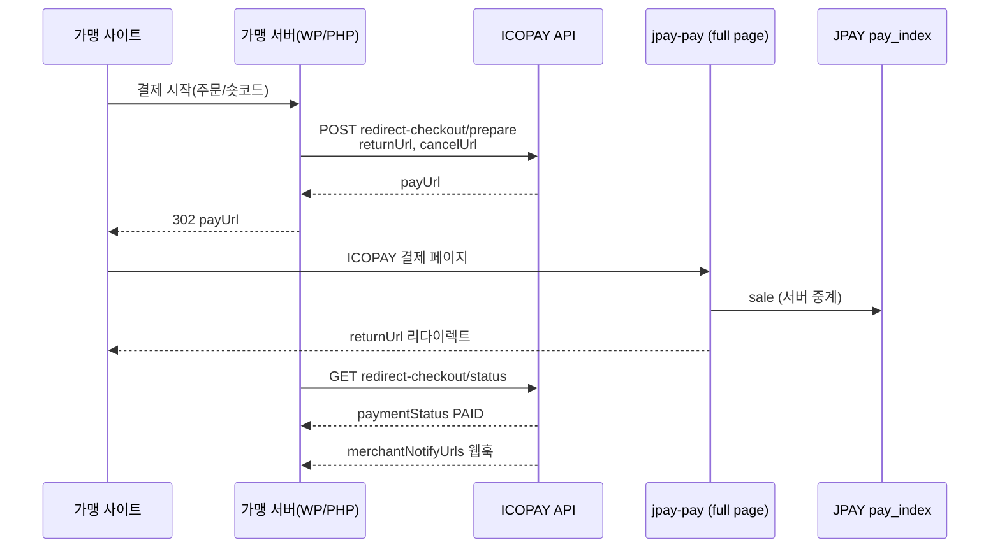

# JPAY 리다이렉트 배포 가이드

| 항목 | 내용 |
|------|------|
| **문서명** | JPAY URL 결제 — Redirect(API 중계형) 배포 가이드 |
| **연동 방식** | API 중계형 **REDIRECT** — 고객 브라우저가 ICOPAY 결제 페이지로 이동 |
| **API 경로** | `/api/middleware/v1/merchant/jpay/redirect-checkout/*` |
| **WordPress** | `icopay-jpay` · `icopay-woocommerce` v1.1+ (`flow_mode=redirect`) |

> Inline(iframe) 배포는 `JPAY_URL결제_인라인API_배포가이드.md` 를 참고하세요.

---

## 1. Inline vs Redirect

| 구분 | Inline | Redirect |
|------|--------|----------|
| 고객 UX | 가맹 사이트 내 iframe | ICOPAY pay 페이지 전체 화면 |
| prepare API | `…/inline-checkout/prepare` | `…/redirect-checkout/prepare` |
| prepare 응답 핵심 | `sessionToken`, `embedScriptUrl` | `payUrl` |
| 완료 감지 | postMessage + status + 웹훅 | returnUrl + status + 웹훅 |
| 본사 스위치 | API 중계형 INLINE Y | API 중계형 REDIRECT Y |

**기본값:** 모든 WordPress 플러그인은 `flow_mode=inline` — 기존 v1.0 WooCommerce 동작과 동일합니다.

---

## 2. 전체 흐름



---

## 3. 본사(HQ) 설정

관리자: `https://icopay.co.kr` → **결제로직설정**

| 항목 | Redirect 사용 시 |
|------|------------------|
| API 중계형 REDIRECT 제공 | **Y** (`apiBrokerRedirectEnabledYn`) |
| API 중계형 기본 방식 | REDIRECT 또는 가맹 플러그인에서 redirect 선택 |
| 가맹 JPAY WEB PG 바인딩 | 운영 MID 등록 |
| 가맹 웹결제 | Y |

ChillPay Redirect: `…/chillpay/redirect-checkout/prepare` — WooCommerce vendor=chillpay + flow_mode=redirect

---

## 4. API 요약

### Prepare

```
POST {API}/api/middleware/v1/merchant/jpay/redirect-checkout/prepare
Header: X-Icopay-Merchant-Broker-Secret
```

```json
{
  "compId": "M000123",
  "orderNo": "ORD-001",
  "amount": "100.00",
  "currency": "USD",
  "productName": "Sample",
  "returnUrl": "https://shop.example/icopay-jpay/return/?order_no=ORD-001",
  "cancelUrl": "https://shop.example/",
  "lang": "ENG"
}
```

성공 응답 `data.payUrl` — 브라우저를 이 URL로 리다이렉트합니다.

### Status

```
GET {API}/api/middleware/v1/merchant/jpay/redirect-checkout/status?compId=&orderNo=
Header: X-Icopay-Merchant-Broker-Secret
```

`paymentStatus=PAID` 이면 주문 완료 처리(멱등).

---

## 5. WordPress 연동

### icopay-jpay

- **설정 → ICOPAY JPAY → Checkout flow: Redirect**
- Return page 지정
- prepare 시 `returnUrl` = `/icopay-jpay/return/?order_no=…`

### icopay-woocommerce v1.1+

- **WooCommerce → 설정 → 결제 → ICOPAY → Checkout flow: Redirect**
- 복귀 URL: `?wc-api=icopay_return&order_id=&key=` (플러그인 자동 생성)
- 웹훅: ` /wp-json/icopay/v1/webhook` (v1.0과 동일)

---

## 6. returnUrl 요구사항

- HTTPS 권장
- 가맹 도메인 공개 URL (ICOPAY·PG 콜백 허용)
- 복귀 후 **status API** 또는 **웹훅**으로 PAID 확인 (URL 파라미터만 신뢰하지 않음)

---

## 7. 오류 코드

| errorCode | 조치 |
|-----------|------|
| `REDIRECT_NOT_ENABLED` | HQ API 중계형 REDIRECT Y |
| `BROKER_AUTH` | broker secret 확인 |
| `URL_PAYMENT_PG_MISSING` | JPAY WEB 바인딩 |
| `INVALID_ORDER_NO` | orderNo 형식·길이 |

---

## 8. ZIP 빌드·배포

```powershell
.\tools\build-wp-plugin-zips.ps1
```

- WooCommerce: `woocommerce/icopay-woocommerce-1.1.0.zip`
- 일반 WP: `wordpress/icopay-jpay-1.0.0.zip`

WordPress `/wp-content/plugins/` 업로드 후 활성화, Permalink 저장.

---

## 9. 관련 문서

- `WordPress_JPAY_플러그인_배포가이드.md`
- `JPAY_URL결제_인라인API_배포가이드.md`
- `JPAY_연동_변경이력.md`
