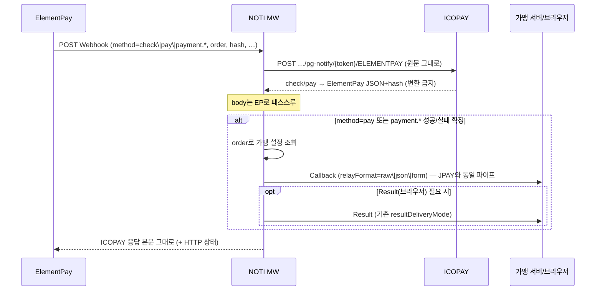

# NOTI — ElementPay(EP) 가맹 통보 추가 개발 요청

| 항목 | 내용 |
|------|------|
| **문서 버전** | 1.0 |
| **작성일** | 2026-08-13 |
| **요청 주체** | ICOPAY (본 저장소) |
| **구현 주체** | **NOTI(노티미들웨어)** — [ziobiz/NOTI](https://github.com/ziobiz/NOTI) |
| **관련 문서** | `docs/NOTI_노티재전송_Cursor개발요청.md`, `docs/전산노티_연동_NOTI.md`, `docs/ICOPAY_Provision_API_JPAY_v0.1.md` |
| **운영 NOTI** | https://noti.icopay.net |
| **목적** | EP는 PG Webhook이 **1개(고정)** 뿐이므로, **가맹점 Callback/Result 통보를 NOTI가 JPAY와 동일 방식(JSON·FORM·raw)으로** 수행해야 함 |

---

## 1. 결론 (한 줄)

**ElementPay → NOTI(고정 Webhook 1개) → (1) ICOPAY 전산 적재 + (2) 가맹 통보**  
가맹 통보 포맷·옵션·재시도는 **기존 JPAY 릴레이와 동일**해야 한다.  
→ **NOTI 추가 개발 필수.** (EP 캐비닛·결제 API에는 가맹별 노티 URL을 넣을 수 없음)

---

## 2. 배경 — JPAY vs ElementPay

### 2.1 JPAY (이미 동작)

```
JPAY ──pay_notifyurl──▶ NOTI /noti/callback/j{N}  ──▶ 가맹 Callback (JSON|FORM|raw)
     ──pay_callbackurl─▶ NOTI /noti/result/j{N}    ──▶ 가맹 Result
                         NOTI ─────────────────────▶ ICOPAY 전산
```

- 가맹마다 NOTI URL이 다름 → NOTI가 **어느 가맹인지** 경로만으로 앎.
- `options.relayFormat`: `raw` | `json` | `form` (ICOPAY 노티생성 `relayFormat`과 동일).

### 2.2 ElementPay (갭)

```
EP ──Webhook(고정 1개)──▶ NOTI ──▶ ICOPAY …/ELEMENTPAY   ← 전산만 (합의됨)
                         NOTI ──▶ 가맹 Callback/Result      ← ❌ 미구현 (본 요청)
```

- EP `initPayment`에는 **Webhook URL 파라미터가 없음** (`_successUrl` 등은 브라우저 복귀용).
- EP 캐비닛 Webhooks에 가맹마다 URL을 넣는 구조가 아님 (본사 집계 MID 1개).
- 따라서 **가맹 통보는 NOTI가 `order`로 가맹을 찾아** 기존 릴레이 파이프로 보내야 함.

### 2.3 ICOPAY 현재 코드 참고

- EP `check`/`pay` 동기 처리: `ElementPayCallbackService` → `…/ELEMENTPAY`.
- ICOPAY `MerchantOutboundNotifyService`는 **ChillPay·JPAY만** 가맹 아웃바운드 허용 → EP는 ICOPAY 직접 가맹통보 **의도적으로 쓰지 않음**.
- **가맹 통보 주체 = NOTI** 가 운영 원칙.

---

## 3. 목표 아키텍처



| 구간 | 담당 | 비고 |
|------|------|------|
| EP → NOTI | EP 캐비닛 Webhook **1 URL** | 본사 고정, 가맹별 등록 금지 |
| NOTI → ICOPAY | 기존 합의 | `ELEMENTPAY` 경로, check/pay 응답 **무변환** |
| NOTI → 가맹 | **본 개발** | JPAY `enableRelay` + `relayFormat` 등과 **동일** |
| EP → 가맹 직접 | 없음 | |

---

## 4. NOTI 개발 범위 (필수)

### 4.1 EP 전용 Ingress (고정 Webhook)

| 항목 | 요구 |
|------|------|
| URL 예 | `https://noti.icopay.net/…/elementpay` (경로는 NOTI 관례에 맞게 확정) |
| 등록 위치 | ElementPay Client Cabinet → **Settings → Webhooks** (본사 1회) |
| 수신 | `application/x-www-form-urlencoded` — `method`, `order`, `id`, `amount`, `currency`, `hash`, `timestamp`, … |
| 동작 | (1) ICOPAY로 **원문 중계** (2) 가맹 통보(아래) (3) ICOPAY 응답을 EP에 **그대로** 반환 |

**ICOPAY 중계 URL**

```
POST {ICOPAY_PUBLIC_BASE}/api/middleware/notify/v1/pg-notify/{ingressToken}/ELEMENTPAY
Content-Type: application/x-www-form-urlencoded
(본문 = ElementPay가 보낸 원문)
```

- `check` / `pay`: 응답 본문 `{ "response": { "status", "message", "timestamp" }, "hash" }` **변환·치환 금지**.
- ChillPay용 `{ success, processed }` 규칙 **적용 금지**.
- 재전송 시 원문·hash 불변. (권장) ICOPAY로 `X-Icopay-Notify-Delivery: LIVE|RETRY`.

상세: `docs/NOTI_노티재전송_Cursor개발요청.md` § ElementPay.

### 4.2 가맹 식별 (`order`)

EP 웹훅에는 가맹 업체코드가 없음. **`order`(주문번호)** 가 키.

**권장 (택1, 협의)**

| 방안 | 설명 | 비고 |
|------|------|------|
| **A. ICOPAY 응답 헤더** (권장) | ICOPAY가 check/pay 응답에 `X-Icopay-Comp-Id`, `X-Icopay-Order-No` 등 부여. NOTI는 **헤더만 읽고 본문은 EP에 그대로** | 본문 패스스루 유지 |
| **B. ICOPAY resolve API** | `order` → `compId` 조회 API 호출 후 가맹 설정 로드 | 추가 RTT |
| **C. NOTI 로컬 매핑** | provision 시 `merchantId`만 저장하고, 결제 생성 시 ICOPAY→NOTI로 order 사전 등록 | 복잡도 높음 — 비권장 |

`pay`에서 가맹을 못 찾으면: ICOPAY 응답은 여전히 EP에 반환하되, 가맹 Callback은 실패 로그·재시도 큐 (JPAY 릴레이 실패와 동일 정책).

### 4.3 가맹 통보 — **JPAY와 동일 방식 (필수)**

가맹에 보내는 방식은 기존 NOTI JPAY 릴레이와 **완전히 동일**해야 한다.

| 항목 | 요구 |
|------|------|
| Callback (서버) | 가맹 `callbackUrl` 로 POST |
| Result (브라우저) | 가맹 `resultUrl` — `resultDeliveryMode` 기존 규칙 (`auto` 등) |
| **relayFormat** | **`raw` \| `json` \| `form`** — JPAY provision `options.relayFormat` 과 동일 |
| Content-Type | `json` → `application/json` / `form` → `application/x-www-form-urlencoded` / `raw` → 기존 JPAY raw 정의 |
| enableRelay / enableInternal / enableDevInternal / URL·하이브리드·개발노티 | JPAY 노티생성과 **동일 옵션·동일 분기** |
| 재시도·로그 | 기존 NOTI 가맹 릴레이 재시도·감사 로그 재사용 |
| 페이로드 필드 | **기존 JPAY→가맹 통보 스키마와 동일** (가맹이 PG 종류를 몰라도 동일 파서 사용 가능해야 함). EP 전용 필드를 넣을 경우 **하위 호환 추가만** 허용 (`van`/`pgKind=elementpay` 등 optional) |

> **금지:** EP 원문 form을 가맹에 그대로 던지는 것만으로 “끝” 처리하지 말 것.  
> 가맹은 이미 JPAY/일반 노티에서 받는 **JSON / FORM / raw** 계약에 맞춰져 있음.

### 4.4 어느 method에서 가맹 통보인가

| EP `method` | ICOPAY | 가맹 Callback | 가맹 Result |
|-------------|--------|---------------|-------------|
| `check` | 동기 검증 응답 | **보내지 않음** | 없음 |
| `pay` | 성공 시 적재 | **필수** (성공 확정) | 정책에 따라 (브라우저 복귀는 EP `_successUrl`과 역할 분리 — 아래 주석) |
| `payment.*` (예: rejected) | 비동기 적재 | **상태 변경 시** JPAY와 동일 기준으로 송부 | 해당 시 |

**브라우저 Result vs EP Redirect**

- EP는 `_successUrl` / `_rejectUrl` / `_waitingUrl` 로 **구매자 브라우저**를 ICOPAY 중립 페이지로 보낼 수 있음.
- NOTI Result URL은 JPAY와 같이 **가맹 Result 페이지**용.  
  EP에서 Result를 NOTI가 직접 제어하지 못하는 경우가 많으므로, **1차는 Callback(서버) 필수**, Result는 가맹 설정이 있고 전달 가능한 이벤트에서만 (기존 `resultDeliveryMode`).

### 4.5 EP 가맹 Provision (NOTI 설정)

EP 가맹도 NOTI에 **통보 설정 레코드**가 있어야 한다.  
단, JPAY와 달리 **PG에 등록할 callback/j{N} URL은 발급·사용하지 않음.**

| 항목 | JPAY | ElementPay |
|------|------|------------|
| `pgKind` | `jpay` | **`elementpay`** (신규) |
| PG 수신 URL (`/noti/callback/j{N}`) | 발급 → ICOPAY JPAY 수신통보 URL | **발급하지 않음** (또는 내부 미사용) |
| 가맹 `callbackUrl` / `resultUrl` | 사용 | **동일하게 사용** |
| `relayFormat` 등 options | 사용 | **동일** |
| 전산 `internalTargetId` | 사용 | **동일** (ICOPAY ELEMENTPAY ingress) |
| 가맹 매칭 키 | 경로 `j{N}` | **`merchantId`(compId) + order→compId** |

**Provision API 확장 (권장)**

- 기존 `POST /api/v1/icopay/merchants/provision` 에 `pgKind: "elementpay"` 허용.
- 응답에 `pgCallbackUrl`/`icopayJpayNotifyUrl` 은 비우거나 생략.  
  ICOPAY는 EP용으로 그 URL을 업체 JPAY 수신통보에 **넣지 않음**.
- ICOPAY 운영관리 「노티생성」2차: EP 전용 버튼/모드 (본 PG 저장소 후속).

관리자 UI: `/admin/merchants?kind=elementpay` 목록·편집 (JPAY 화면 복제 + 슬롯 URL 숨김).

---

## 5. ICOPAY 측 협조 (소규모, 본 저장소)

NOTI 개발과 병행해 ICOPAY에서 제공할 수 있는 것:

| # | 항목 | 상태 |
|---|------|------|
| 1 | `…/ELEMENTPAY` check/pay 처리·적재 | 구현됨 |
| 2 | 응답 헤더 `X-Icopay-Comp-Id` 등 (방안 A) | **요청 시 추가 가능** |
| 3 | EP 노티생성 UI/`pgKind=elementpay` 호출 | NOTI API 준비 후 |
| 4 | EP 가맹에 대한 ICOPAY 직접 아웃바운드 | **하지 않음** (NOTI 전담) |

---

## 6. 운영·등록 체크리스트

### 본사 1회

- [ ] EP Sandbox/Live API Keys
- [ ] EP Webhooks → **NOTI EP Ingress URL 1개**
- [ ] NOTI → ICOPAY `…/ELEMENTPAY` 토큰·베이스 URL
- [ ] Signing secret / EP Secret Key 보관

### 가맹 신규 (EP)

- [ ] ICOPAY 업체 + ELEMENTPAY 바인딩
- [ ] NOTI에 `pgKind=elementpay` 가맹 provision (callback/result + **relayFormat**)
- [ ] ~~EP 캐비닛에 가맹 URL~~ 금지
- [ ] ~~업체 JPAY 수신통보 URL에 EP URL~~ 금지 (JPAY 병행 시에만 JPAY용 유지)

---

## 7. 테스트 시나리오

| # | 시나리오 | 기대 |
|---|----------|------|
| 1 | `check` | ICOPAY 응답 EP 패스스루, **가맹 Callback 없음** |
| 2 | `pay` 성공 + relayFormat=`json` | 가맹이 JPAY와 동일 JSON 수신, HTTP 2xx |
| 3 | `pay` 성공 + `form` | `x-www-form-urlencoded` 로 동일 필드 수신 |
| 4 | `pay` 성공 + `raw` | JPAY raw 와 동일 |
| 5 | 알 수 없는 `order` | EP 응답은 유지, 가맹 통보 실패 로그·재시도 |
| 6 | ICOPAY 다운 | EP에 적절한 오류(합의), 가맹 통보 보류/재시도 |
| 7 | 재전송 RETRY | hash 불변, 가맹 멱등 처리 |

---

## 8. 산출물·일정 제안

| 산출물 | 담당 |
|--------|------|
| EP Ingress 엔드포인트 + ICOPAY 패스스루 | NOTI |
| order→가맹 매칭 + JPAY 동일 릴레이(JSON/FORM/raw) | NOTI |
| `pgKind=elementpay` provision API·관리 UI | NOTI |
| (선택) ICOPAY 응답 헤더 compId | ICOPAY |
| 본 문서 검수·연동 테스트 | 양측 |

**개발 순서 권장:**  
① EP Ingress + ICOPAY 패스스루 안정화 → ② 가맹 매칭 + Callback(json/form/raw) → ③ provision API → ④ ICOPAY 노티생성 연동.

---

## 9. 저장소 접근

| 저장소 | URL | 역할 |
|--------|-----|------|
| **NOTI** | https://github.com/ziobiz/NOTI | **본 기능 구현 위치** |
| **ICOPAY(PG)** | 본 저장소 | 스펙·ICOPAY ingress·후속 provision UI |

NOTI 저장소에 Cursor/이슈로 본 문서를 붙여 **ElementPay 가맹 통보** 이슈를 열어 진행하면 됩니다.  
ICOPAY 쪽 헤더/조회 API가 필요하면 본 문서 §5를 기준으로 이어서 구현합니다.

---

*본 문서는 ICOPAY(PG) 저장소에서 NOTI 팀 전달·Cursor 작업용으로 유지한다.*
